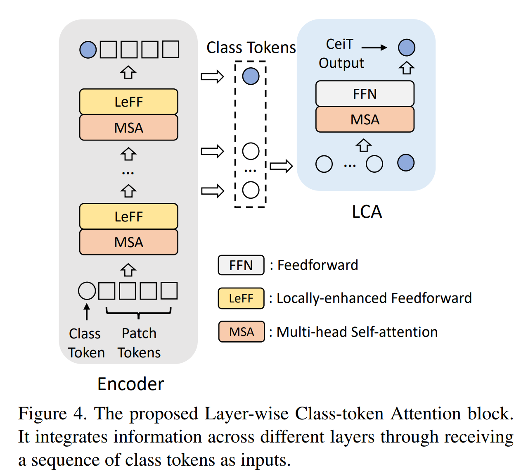
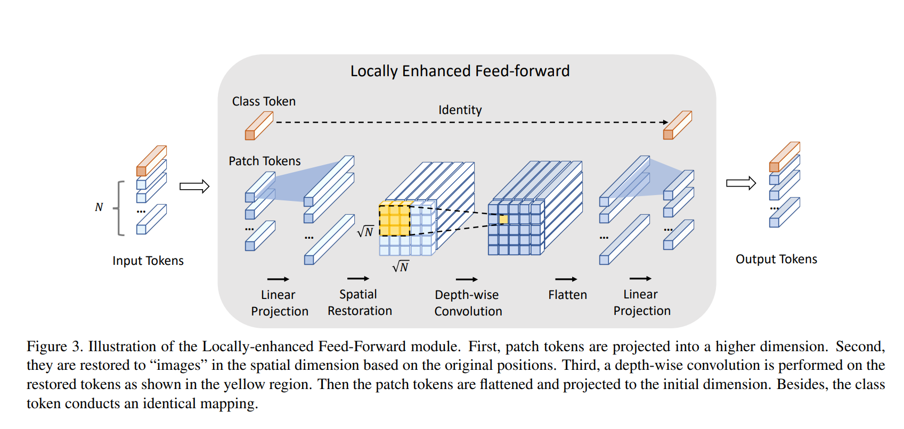

# CeiT : Convolutional enhanced image Transformer
This is an unofficial PyTorch implementation of [Incorporating Convolution Designs into Visual Transformers](https://arxiv.org/abs/2103.11816) .


## Usage :
```python
import torch
from ceit import CeiT

img = torch.ones([1, 3, 224, 224])
    
model = CeiT(image_size = 224, patch_size = 4, num_classes = 100)
out = model(img)

print("Shape of out :", out.shape)      # [B, num_classes]

model = CeiT(image_size = 224, patch_size = 4, num_classes = 100, with_lca = True)
out = model(img)

print("Shape of out :", out.shape)      # [B, num_classes]

```


## Note :
* LCA implementation is incomplete although the code is usable even without it.

## Citation
```
@misc{yuan2021incorporating,
      title={Incorporating Convolution Designs into Visual Transformers}, 
      author={Kun Yuan and Shaopeng Guo and Ziwei Liu and Aojun Zhou and Fengwei Yu and Wei Wu},
      year={2021},
      eprint={2103.11816},
      archivePrefix={arXiv},
      primaryClass={cs.CV}
}
```

## Acknowledgement
* Base ViT code is from [@lucidrains](https://github.com/lucidrains) repo : https://github.com/lucidrains/vit-pytorch
